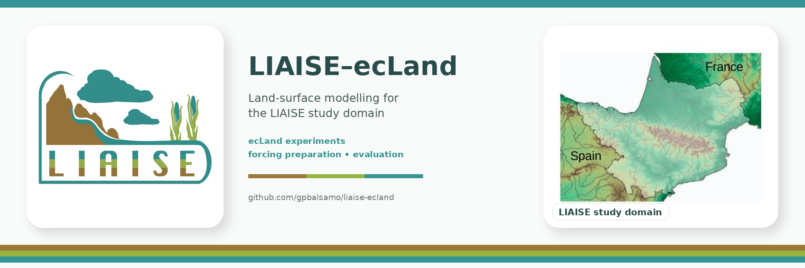

# LIAISE ecLand workflow

Scripts and configuration for preparing and running ecLand over the LIAISE
domain using WFDE5-CRU-GPCC forcing.

To learn more about the LIAISE field campaign, see the
[LIAISE data portal](https://liaise.aeris-data.fr/) and, for details on the
meteorological forcing adopted here, the
[LIAISE forcing wiki](https://gitlab.in2p3.fr/ipsl/lmd/intro/liaise-forcing/-/wikis/home).

## Workflow

1. Prepare ecLand ancillary fields:

   ```bash
   cd init_clim
   ./clim.sh
   ./init_clim.sh
   ```

   This requires MARS access. Outside ECMWF (for example on macOS), install
   the pre-generated, validated `surfclim`/`soilinit` files instead. They are
   tracked via Git LFS under `init_clim/data/`:

   ```bash
   git lfs pull
   cd init_clim
   ./get_init_clim.sh
   ```

2. Download and process annual forcing files:
   ```bash
   cd forcing
   ./get_liaise_forcing_05.sh
  
   python3 prepare_liaise_forcing_ecland.py \
    --input-dir WFDE5_CRU_GPCC \
    --output-dir WFDE5_CRU_GPCC_ecland \
    --start-year 1988 \
    --end-year 2014 \
    --repeat-last-for-final-year
   ```

   `get_liaise_forcing_05.sh` mirrors 1988-2014 from IPSL. For later years,
   `get_liaise_forcing_05_cds.sh` downloads the same WFDE5-CRU-GPCC product
   from the Copernicus Climate Data Store and assembles it into the same
   `WFDE5_CRU_GPCC_{year}.nc` layout, so it can be followed by the same
   `prepare_liaise_forcing_ecland.py` call (with `--start-year`/`--end-year`
   adjusted). It requires `pip install cdsapi` and a configured
   `~/.cdsapirc`:
   ```bash
   cd forcing
   START_YEAR=2015 END_YEAR=2024 ./get_liaise_forcing_05_cds.sh
   ```

Each annual file uses as time reference:
hours since 1988-01-01 00:00:00
and it contains an additional endpoint at 00 UTC on 1 January of the
following year. For the final year, the final forcing record is repeated.

3. Generate the ecLand namelist:

   ```bash
   cd namelist
   ./create_liaise_namelist.sh
   ```

3b. (Optional) Derive CaMa-Flood coupling weights:

   ```bash
   cd cama_flood
   ./derive_cmf_weights.sh
   ```

   Produces the interpolation weights between the LIAISE ecLand grid and the
   CaMa-Flood river network, plus the clipped river-network fix files, for
   running ecLand coupled to CaMa-Flood river routing (`LECMF1WAY=.T.` in
   the namelist). Validated reference output is tracked under
   `cama_flood/data/` via Git LFS; run `git lfs pull` to fetch it instead of
   regenerating it.

   To actually enable the coupling, set `LECMF1WAY=true` when running
   `namelist/create_liaise_namelist.sh` (step 3) and regenerate
   `namelist/input`. `run/run_liaise_ecland.sh` detects this automatically
   at run time and stages/patches `namelist/input_cmf` and the
   `cama_flood/data/` files for you -- no separate flag needed.

4. Run ecLand interactively:

   ```bash
   cd run
   ./run_liaise_ecland.sh
   ```

5. Run ecLand through Slurm:

This is alternative to 4. in case of an HPC setup
   ```bash
   cd run
   sbatch run_liaise_ecland.slurm
   ```

## Repository content
   ```bash
   forcing/
     get_liaise_forcing_05.sh 
     get_liaise_forcing_05_cds.py
     get_liaise_forcing_05_cds.sh
     get_liaise_forcing_km.sh
     prepare_liaise_forcing_ecland.py
     prepare_liaise_forcing_ecland.sh

   init_clim/
     clim.sh
     init_clim.py
     init_clim.sh
     get_init_clim.sh
     data/
       soilinit
       surfclim

   namelist/
     create_liaise_namelist.sh
     input
     input_cmf

   run/
     postprocess_liaise_ecland.sh
     run_liaise_ecland.sh
     run_liaise_ecland.slurm

   cama_flood/
     derive_cmf_weights.sh
     inpmat_to_cmfgpu_npz.py
     data/
       inpmat.nc
       ncdata.nc
       rivclim.nc
       rivpar.nc
       outclm.nc
       bifprm.txt
       diminfo.txt
   ```

Large forcing datasets, generated ancillary files, outputs, logs, work
directories, and restart files are intentionally excluded from Git. The
exception is `init_clim/data/soilinit`, `init_clim/data/surfclim`, and
`cama_flood/data/`, which are tracked via Git LFS as validated reference
files.

## CaMa-Flood-GPU coupling (in progress)

Alongside the Fortran `ecland`/`LECMF1WAY` coupling above, there's ongoing
work to couple CaMa-Flood to `ecLandPy` (`/perm/pad/eclandpy`, a
from-scratch Python land-surface model) via
[**CaMa-Flood-GPU**](https://github.com/Kshy0/CaMa-Flood-GPU), a GPU
reimplementation of CaMa-Flood built on PyTorch/Triton/CUDA:

> Kang, S., Yin, J., & Yamazaki, D. (2026). CaMa-Flood-GPU: A GPU-based
> hydrodynamic model implementation for scalable global simulations.
> *Geoscientific Model Development*, 19(12), 5623–5640.
> https://doi.org/10.5194/gmd-19-5623-2026

`cama_flood/inpmat_to_cmfgpu_npz.py` bridges the two projects' different
runoff-mapping formats: it re-encodes this repo's already-validated
`inpmat.nc` interpolation weights into the sparse `.npz` format
CaMa-Flood-GPU's dataset classes consume directly, including the inverse
(catchment -> grid) mapping needed for a future 2-way coupling. See
`CLAUDE.md` ("CaMa-Flood coupling" -> "CaMa-Flood-GPU coupling prep") for
how it works and what's been validated so far.

